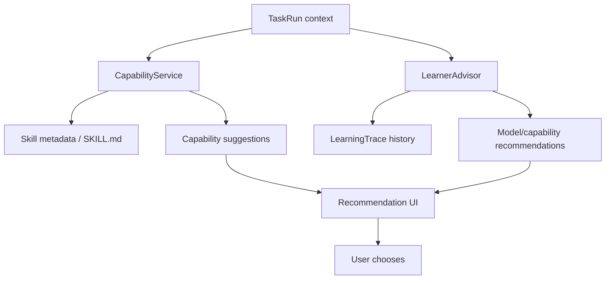

# Capability And Learning Architecture

## 목적

Skillify와 Learner를 Harness OS의 자동 실행자가 아니라 추천과 근거 제공 계층으로 배치하는 아키텍처를 정의한다.

## 계층 구조



## Capability 역할

Capability는 재사용 가능한 능력 단위다.

- built-in capability
- imported skill
- Skillify-derived skill
- runner-backed capability

Capability는 실행 권한이 없다. 실행이 필요한 경우 approval을 생성하고 Runner 계층으로 넘긴다.

## Skill loading 원칙

- metadata는 app boot 또는 refresh 때 읽는다.
- instruction은 사용자가 skill detail을 열거나 추천이 선택된 경우에만 읽는다.
- script는 approval 없이 실행하지 않는다.
- untrusted skill은 기본 비활성화한다.

## Learner 역할

Learner는 실행 결과를 관찰하고 다음 작업에 추천 근거를 제공한다.

저장하는 정보:

- selected model
- selected capabilities
- reward
- success/failure
- latency
- cost estimate
- failure reason
- accepted/rejected recommendation decision

금지:

- 자동 prompt promotion
- 자동 pipeline activation
- 자동 agent type promotion
- 자동 high risk approval
- 사용자에게 보이지 않는 route 변경

## 추천 흐름

```text
TaskRun created
  -> CapabilityService suggests skills
  -> LearnerAdvisor suggests model/capabilities from traces
  -> UI shows recommendation and rationale
  -> user accepts/rejects
  -> decision recorded
  -> selected capability influences plan context, not direct execution
```

## Trace와 privacy

LearningTrace는 요약과 artifact id만 저장한다. 전체 stdout/stderr, 파일 본문, secret-looking token은 trace에 저장하지 않는다.

## 수용 기준

- Skillify-derived capability가 추천되어도 자동 실행되지 않는다.
- Learner recommendation은 실행 권한을 갖지 않는다.
- 사용자가 추천을 거절해도 TaskRun이 실패하지 않는다.
- 추천의 근거와 위험 수준이 UI에 표시된다.
