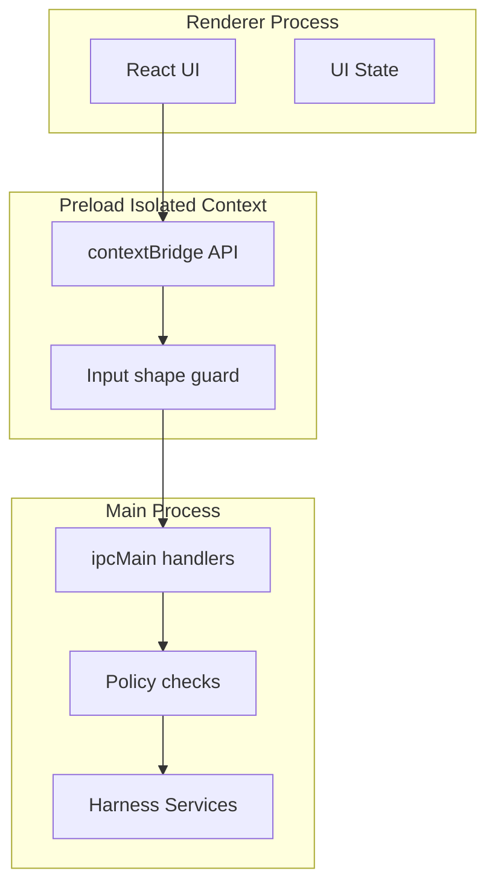

# Process And IPC Architecture

## 목적

Electron renderer, preload, main process 사이의 권한 경계와 IPC 설계 원칙을 정의한다.

## 프로세스 경계



## Renderer 책임

- 대화 입력 표시와 제출
- Thread/TaskRun/Step/Artifact/Quality 상태 렌더링
- 승인/거절/수정 지시 입력
- diff/log/test result 표시
- 직접 파일, process, DB, shell 접근 금지

## Preload 책임

- `window.harness` API 노출
- raw `ipcRenderer` 비노출
- method별 payload shape 최소 검증
- renderer가 알 필요 없는 Electron 객체 차단

## Main process 책임

- IPC handler 등록
- SQLite repository와 service 실행
- filesystem/path validation
- runner 실행
- approval policy 적용
- artifact 저장
- quality evaluation

## IPC namespace

```ts
window.harness = {
  app: { getVersion, getRuntimeInfo, selectDirectory },
  state: { listThreads, getThread, createThread },
  conversation: {
    createTask, redirectTask, approve, rejectApproval,
    getTaskRunDetail, setProposedAction,
    pauseTask, resumeTask, cancelTask,
  },
  runner: { executeApproved, listArtifacts, readArtifact, retryApproval },
  quality: {
    evaluate, getLatest, approveKnownRisks,
    createRepairPlan, markReadyForReview, markDone,
  },
  capability: { list, refresh, suggest, readSkill, proposeScriptRun },
  learner: {
    getTrace, recommend, recordSelection, recordOutcome, recordDecision,
  },
  orchestration: { getPlan, draftPlan, runApproved },
  events: { onTaskRunChanged },
}
```

Phase별로 필요한 namespace만 추가한다. 정확한 시그니처와 에러 코드는 `docs/contracts/ipc-contracts.md`가 단일 소스다.

## IPC 규칙

- 대부분의 method는 request/response형 `invoke`를 기본으로 한다.
- 단방향 main → renderer push는 `events` namespace로 한정한다 (현재 `events:taskRunChanged` 한 채널). renderer가 polling 없이 캐노니컬 상태 변경을 따라잡기 위한 보조 채널이며, 임의 상태/페이로드는 보내지 않는다.
- renderer에서 channel string을 지정하게 하지 않는다.
- error는 `HarnessError` shape로 normalize한다.
- Main handler 내부가 `HarnessResult<T>`를 반환하는 경우 preload가 unwrap한다. `ok: true`는 `value`를 resolve하고, `ok: false`는 포함된 `HarnessError`를 throw하므로 renderer-facing API는 `Promise<T>`로 보인다.
- handler는 service를 호출하고 business logic을 직접 갖지 않는다.

## 실패 처리

IPC handler는 오류를 세 계층으로 나눈다.

| 오류 | 예시 | 처리 |
|---|---|---|
| Validation | payload 누락, 잘못된 id | renderer에 inline 오류 |
| Policy | 승인 없음, targetDir 밖 접근 | action 차단 및 설명 표시 |
| Runtime | DB 오류, command 실패 | artifact 또는 error detail로 기록 |

## 보안 기본값

```ts
webPreferences: {
  nodeIntegration: false,
  contextIsolation: true,
  sandbox: true,
  preload: preloadPath
}
```

금지:

- `contextBridge.exposeInMainWorld('electron', ipcRenderer)` 형태
- wildcard IPC proxy
- renderer SQL 전달
- renderer shell command 직접 전달 후 즉시 실행

## 수용 기준

- renderer에서 `require`, `process`, `fs`, `child_process`에 직접 접근할 수 없다.
- preload API만으로 모든 UI 기능을 수행한다.
- IPC 추가 시 namespace, payload type, error type이 문서화된다.

