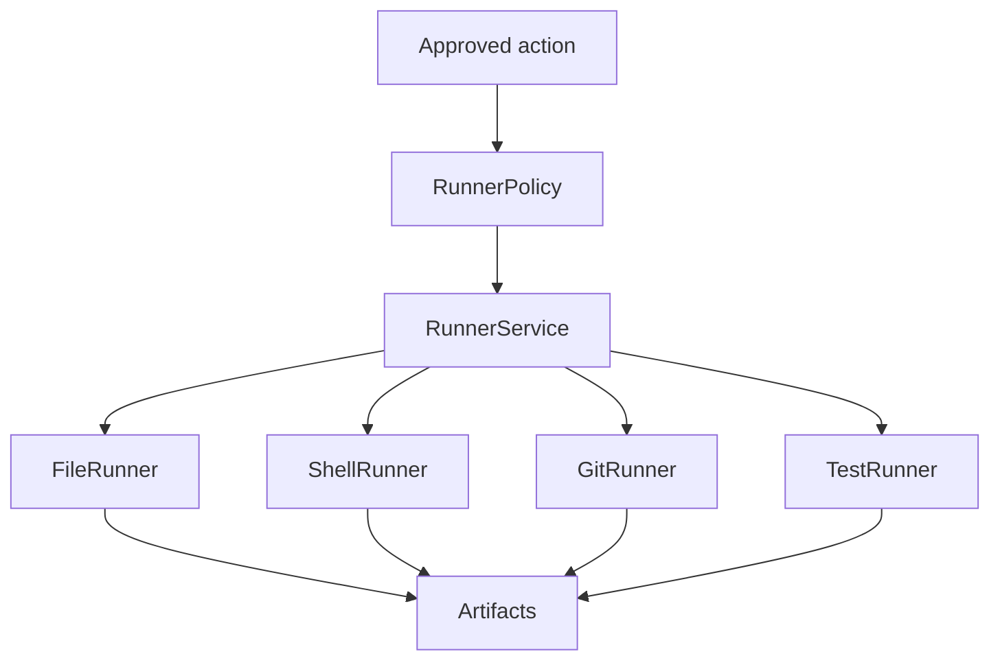
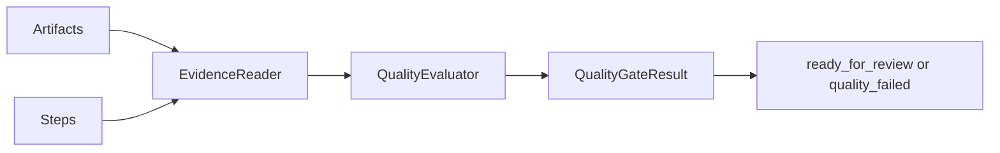

# Runner And Quality Architecture

## 목적

승인된 action을 실행하는 runner 계층과, 완료 전 증거 기반으로 품질을 판정하는 quality gate 계층을 정의한다.

## Runner 계층



## Runner 종류

| Runner | 책임 | 산출물 |
|---|---|---|
| FileRunner | 승인된 patch/write 수행 | changed files, diff |
| ShellRunner | 승인된 shell command 수행 | stdout/stderr log |
| GitRunner | status/diff/commit 준비 | diff/status artifact |
| TestRunner | 승인된 test/build command 수행 | test_result/build log |

## Runner 불변식

- approval 없이 실행하지 않는다.
- targetDir containment를 확인한다.
- 실행 결과는 artifact로 남긴다.
- 실패도 artifact와 Step status로 남긴다.
- runner는 TaskRun을 `done`으로 만들 수 없다.

## Quality Gate 계층

Quality Gate는 runner artifact와 TaskRun 상태를 읽어서 완료 가능 여부를 판단한다.



## 평가 항목

| 항목 | 의미 |
|---|---|
| buildPassed | build 명령이 요구되고 성공했는지 |
| testsPassed | test 명령이 요구되고 성공했는지 |
| smokePassed | app 실행 목표에서 smoke evidence가 있는지 |
| changedFilesReviewed | diff artifact가 있고 UI에서 검토 가능한지 |
| knownRisks | 실패, 미실행, 불확실성 목록 |
| evidenceArtifactIds | 판단 근거 artifact 목록 |

## 완료 전환 규칙

- `not_run`은 완료 불가.
- `failed`는 완료 불가. repair 또는 risk approval 필요.
- `warning`은 known risk 승인 후 ready_for_review 가능.
- `passed`는 ready_for_review 가능.
- 최종 `done`은 사용자 final approval 뒤에만 가능.

## Repair loop

품질 실패는 새 작업이 아니라 같은 TaskRun의 후속 loop로 취급한다.

```text
quality_failed
  -> repair plan artifact
  -> before_edit checkpoint
  -> approval pending
  -> runner execution
  -> quality.evaluate again
```

## 수용 기준

- runner 실패가 품질 결과에서 누락되지 않는다.
- test/build 미실행을 성공으로 간주하지 않는다.
- quality gate 없이 done 전환할 수 없다.
- repair loop가 기존 approval 모델로 돌아간다.

