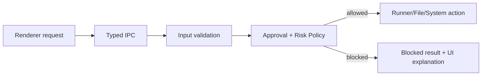

# Security And Approval Architecture

## 목적

HarnessAgentOS에서 사용자의 명시적 승인 없이 위험한 작업이 실행되지 않도록 하는 보안/승인 모델을 정의한다.

## 보안 모델

HarnessAgentOS는 로컬에서 강한 권한을 가진 앱이다. 따라서 보안 모델의 핵심은 renderer를 신뢰하지 않고, main process의 policy gate를 통과한 action만 실행하는 것이다.



## Approval 대상 action

| Action | 기본 정책 |
|---|---|
| file_write | approval required |
| file_delete | blocked or high risk approval |
| shell | approval required |
| dependency_install | high risk, separate approval |
| git_commit | approval required |
| git_push | high risk, MVP blocked |
| network | high risk approval |
| skill_script | approval required, trusted skill only |
| orchestration_plan | approval required, worker plan only |
| targetDir outside access | MVP blocked |

## Approval 상태

```ts
type ApprovalStatus =
  | "pending"
  | "approved"
  | "rejected"
  | "always_approved_for_run";
```

`always_approved_for_run`은 사용자가 `conversation.approve(..., { scope: "run_action_class" })`에 해당하는 선택을 했을 때만 같은 TaskRun 안의 low/medium risk 반복 action class에 허용한다. dependency install, git push, workspace 밖 쓰기에는 적용하지 않는다.

## Risk classification

| Risk | 예시 | 처리 |
|---|---|---|
| low | read-only inspect, git status | 실행 가능 또는 최소 승인 |
| medium | file write, tests, git diff | approval 필요 |
| high | dependency install, delete, network, git push | 별도 경고와 제한 |
| blocked | targetDir 밖 쓰기, destructive git reset | MVP 차단 |

## Path policy

- 모든 path는 main process에서 normalize한다.
- symlink traversal을 고려해 realpath 기준 containment를 확인한다.
- targetDir 내부 파일만 쓰기 가능하다.
- app userData artifact path는 사용자가 선택한 targetDir와 분리한다.

## Secret handling

- stdout/stderr는 artifact로 저장하되 UI 표시 전에 secret-looking token을 마스킹한다.
- LearningTrace에는 전체 로그를 저장하지 않는다.
- approval message에 secret 입력을 유도하지 않는다.

## 거절과 수정 지시

사용자가 action을 거절하면 다음이 일어난다.

- Approval status = rejected
- TaskRun status = paused 또는 blocked
- decisionMessage 저장
- 같은 action은 자동 재시도하지 않음
- redirect instruction이 들어오면 새 plan/checkpoint/approval 생성

## 수용 기준

- approval 없는 side effect 실행 경로가 없다.
- renderer가 직접 runner를 우회 호출할 수 없다.
- high risk action은 UI와 policy 모두에서 구분된다.
- 거절 이유가 기록되고 다음 계획에 반영 가능하다.

