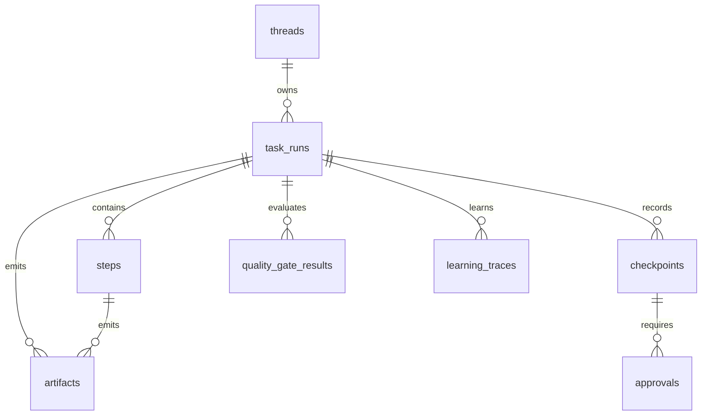

# State And Artifact Architecture

## 목적

HarnessAgentOS의 persistent state, artifact 저장소, snapshot/export 정책을 정의한다.

## Canonical state

SQLite WAL DB가 canonical state다. JSON 파일은 canonical이 아니다.

DB 위치:

```text
app.getPath("userData")/app.db
```

초기화 pragma:

```sql
PRAGMA journal_mode=WAL;
PRAGMA foreign_keys=ON;
PRAGMA busy_timeout=5000;
```

## State domains

| Domain | Table | Owner service |
|---|---|---|
| Thread | `threads` | ThreadService |
| TaskRun | `task_runs` | TaskRunService |
| Step | `steps` | StepService |
| Checkpoint | `checkpoints` | CheckpointService |
| Approval | `approvals` | ApprovalService |
| Artifact | `artifacts` | ArtifactService |
| Quality | `quality_gate_results` | QualityService |
| Capability | `capabilities` | CapabilityService |
| Learning | `learning_traces` | LearnerService |

## 핵심 관계



## Artifact store

Artifact metadata는 DB에 저장하고, 큰 본문은 파일로 저장한다.

위치:

```text
app.getPath("userData")/artifacts/{taskRunId}/{artifactId}.{ext}
```

Artifact kind:

- `plan`
- `diff`
- `log`
- `test_result`
- `quality_report`
- `orchestration_plan`
- `file`
- `snapshot`

Artifact URI는 app-internal URI를 사용한다.

```text
artifact://{taskRunId}/{artifactId}
```

Renderer는 URI를 직접 filesystem path로 해석하지 않는다. `runner.readArtifact` IPC를 통해 content를 요청한다. Phase 7의 orchestration plan은 일반 `plan`과 구분하기 위해 `orchestration_plan` artifact kind를 사용한다.

## Checkpoint state

Checkpoint는 재개 기준점이다. MVP에서는 전체 VM snapshot을 저장하지 않고, 다음 정보를 저장한다.

- TaskRun status
- current step
- pending approvals
- artifact references
- action summary
- targetDir

파일 변경 전 checkpoint는 git diff baseline 또는 file snapshot metadata와 연결한다.

## Snapshot/export

JSON export는 사용자 이동성과 debug를 위한 기능이다.

허용:

- Thread export
- TaskRun summary export
- artifact bundle export
- diagnostic snapshot

금지:

- JSON export를 다시 canonical runtime store처럼 사용하는 것
- JSON과 SQLite를 동시에 source of truth로 유지하는 것

## Migration 원칙

- schema version table을 둔다.
- migration은 idempotent 해야 한다.
- migration 실패 시 앱은 destructive repair를 자동 수행하지 않는다.
- DB reset은 사용자 명시 승인 없이 실행하지 않는다.

## 수용 기준

- 앱 재시작 후 Thread/TaskRun/Artifact 목록이 복원된다.
- Artifact content는 DB row 없이 직접 열리지 않는다.
- JSON export를 삭제해도 앱 core state는 유지된다.
- migration은 반복 실행해도 같은 결과를 낸다.


