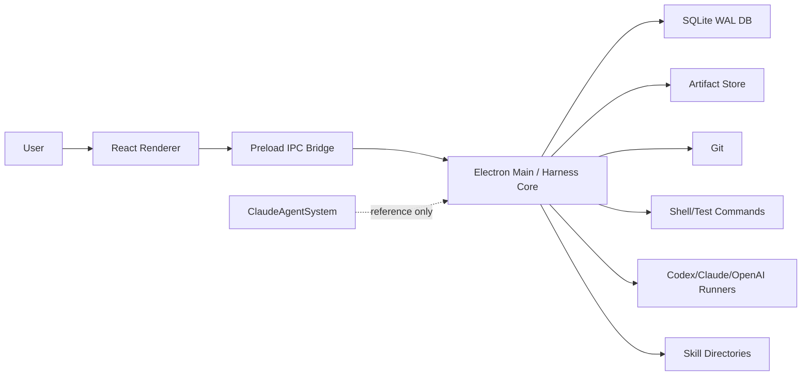

# System Context Architecture

## 목적

이 문서는 HarnessAgentOS가 어떤 시스템 경계 안에서 동작하는지, 어떤 외부 실행자와 통신하는지, 기존 ClaudeAgentSystem과 어떤 관계를 갖는지 정의한다.

## 시스템 경계

HarnessAgentOS는 사용자의 로컬 머신에서 실행되는 데스크톱 개발 워크벤치다. 서버를 운영하지 않고, 로컬 filesystem, git, shell, model CLI/API, SQLite DB를 Electron main process가 통제한다.

## 주요 actor

| Actor | 역할 | 권한 |
|---|---|---|
| User | 작업 요청, 승인, 거절, 방향 수정 | 모든 중요한 side effect의 최종 판단 |
| React Renderer | 상태 표시와 입력 수집 | 직접 filesystem/process 접근 없음 |
| Preload Bridge | 제한 IPC 노출 | channel allowlist와 argument forwarding |
| Electron Main | Harness Core 실행 | filesystem, child process, SQLite 접근 |
| Runner | 승인된 실행 수행 | Harness policy 아래에서만 실행 |
| Skillify Adapter | capability 추천 | 실행 권한 없음, script는 approval 필요 |
| Learner Advisor | 추천 근거 제공 | 실행 권한 없음 |
| ClaudeAgentSystem | 이식 후보/레퍼런스 | 직접 runtime dependency 아님 |

## 외부 의존성

MVP에서 허용하는 외부 의존성:

- Electron
- React
- Vite
- Node.js
- SQLite driver
- git executable
- npm/node test runner
- 선택적 model CLI/API adapter

MVP에서 금지하는 의존성:

- Express server
- localhost API server
- WebSocket server
- MCP server
- LangGraph/Temporal/OpenAI Agents SDK runtime dependency
- 기존 ClaudeAgentSystem runtime import

## ClaudeAgentSystem 관계

ClaudeAgentSystem은 다음 자산의 참고 출처다.

- Skillify runtime/concepts
- Learner trace/reward/cost/latency/model selection feedback
- final quality evaluator
- targetDir resolution
- runner abstraction
- conversation context

금지 사항:

- HarnessAgentOS가 ClaudeAgentSystem의 DB, state, messages 폴더를 직접 runtime dependency로 사용하지 않는다.
- ClaudeAgentSystem 파일을 수정하지 않는다.
- CEO/pipeline/message queue를 MVP 기본 경로로 가져오지 않는다.

## 성공 기준

- 앱이 서버 없이 로컬에서 실행된다.
- 모든 side effect는 Electron main process와 Harness policy를 통과한다.
- 기존 프로젝트가 없어도 HarnessAgentOS core는 동작한다.
- 기존 프로젝트는 이식 시점에만 읽기 참조한다.
