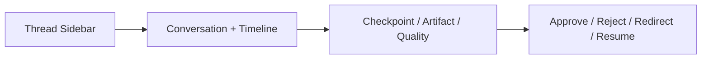

# UI Workbench Architecture

## 목적

HarnessAgentOS의 사용자 인터페이스를 대화형 workbench로 설계하기 위한 정보 구조와 상태 표현 원칙을 정의한다.

## 화면 구조

기본 화면은 landing page가 아니라 바로 작업 가능한 개발 워크벤치다.

## 영역별 책임

| 영역 | 책임 |
|---|---|
| Thread Sidebar | thread 목록, targetDir, 최근 상태 |
| Conversation Workbench | 사용자 입력, Harness 응답, TaskRun 생성 |
| Timeline | Step 진행 상태와 실패 지점 표시 |
| Checkpoint Panel | 중단/재개/거절/수정 지시 기준점 표시 |
| Artifact Panel | plan, diff, log, test result, quality report 표시 |
| Quality Panel | evidence, risk, 완료 가능 여부 표시 |
| Recommendation Panel | capability/learner 추천 표시 |

## 상태 표현 원칙

- 사용자가 다음에 누를 수 있는 action을 명확히 보여준다.
- 실행 중인 Step과 대기 중인 Approval을 숨기지 않는다.
- 실패는 단순 toast가 아니라 timeline과 artifact에 남긴다.
- `done`은 최종 상태이고, `ready_for_review`와 구분한다.
- 모호한 자동화 용어보다 작업 action 중심 문구를 사용한다.

## TaskRun 상태별 UI

| Status | UI |
|---|---|
| drafting | 계획 생성 중 |
| waiting_for_approval | approval panel 강조 |
| running | current step과 log artifact 표시 |
| paused | resume/redirect controls 표시 |
| blocked | failure artifact와 retry controls 표시 |
| quality_failed | QualityPanel과 repair controls 표시 |
| ready_for_review | final approval 표시 |
| done | final summary와 artifacts 표시 |
| cancelled | 취소 이유 표시 |

## 사용자 action

- create task
- approve action
- reject action with reason
- redirect task with instruction
- retry failed step
- run quality gate
- approve known risk
- mark final done

## Responsive 기준

MVP는 desktop 우선이다. 최소 폭이 좁아질 경우 우측 panel은 tabbed drawer로 접는다. 기능을 숨기지 말고 위치만 바꾼다.

## 접근성 기준

- 버튼은 disabled 이유를 tooltip 또는 inline text로 제공한다.
- status는 색상만으로 구분하지 않고 text label을 포함한다.
- log/diff 영역은 monospace와 copy affordance를 제공한다.

## 수용 기준

- 사용자는 현재 작업 상태와 다음 선택지를 한 화면에서 이해할 수 있다.
- 중간 artifact를 UI에서 열 수 있다.
- approval pending 상태가 눈에 띈다.
- 품질 실패와 실행 실패가 서로 구분된다.
