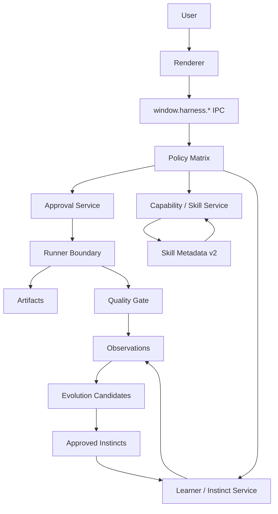

# Agent Framework Unified v4 Adoption Plan

## 목적

`agent_framework_unified_v4.html`에서 정리된 Ruflo, Agno, Hermes, ECC 개념 중
HarnessAgentOS에 실제로 적용할 수 있는 항목을 세부 설계로 변환한다.

이 문서는 외부 프레임워크 설치 계획이 아니다. 현재 프로젝트의 핵심 제약인
Electron IPC, SQLite WAL canonical state, approval-gated side effect,
Skillify/Learner recommendation-only 원칙 안에서 적용 가능한 내부 설계를 정의한다.

## 적용 원칙

1. 외부 Ruflo, Agno, Hermes, ECC npm/package를 기본 설치하지 않는다.
2. Codex hooks나 외부 agent hook은 보안 경계가 아니다. 최종 통제는 Harness policy,
   approval, runner boundary가 맡는다.
3. JSON 파일은 export/debug 용도만 허용하고 canonical state는 SQLite WAL에 둔다.
4. `packages/core`는 타입과 인터페이스만 보유하고 `@harness/storage`를 import하지 않는다.
5. Renderer는 `window.harness.*`만 호출한다. 새 기능은 IPC 계약을 거쳐 노출한다.
6. 모든 side effect는 approval row를 만든 뒤 사용자의 승인 이후에만 실행한다.
7. 학습과 추천은 자동 실행자가 아니라 근거를 제공하는 보조 계층이다.

## 현재 구조와 연결 지점

| 현재 구성 | 역할 | 이번 설계에서의 확장 |
|---|---|---|
| `packages/skillify-adapter` | skill metadata 읽기, capability 추천 | Hermes식 metadata v2와 progressive disclosure |
| `packages/learner` | LearningTrace 기반 추천 | ECC식 observation, instinct, evolution candidate |
| `packages/storage` | SQLite WAL schema/repository/service | instinct/observation/policy decision 저장 |
| `packages/orchestration` | worker plan과 approval 생성 | Ruflo식 제한적 worker topology와 handoff context |
| `packages/agent` | CLI-backed planning | Codex subagent/profile 개념을 Harness AgentProfile로 흡수 |
| `apps/desktop/electron` | IPC, main process policy | policy matrix, instinct, skill management IPC |
| `apps/desktop/src` | Workbench UI | Instinct, Skill, Policy, Topology 검토/승인 UI |

## 프로젝트별 채택 범위

| 프로젝트 | 채택 | 제외 |
|---|---|---|
| ECC | Instinct, Observation, Evolution, confidence, project scope | 외부 hook 자동 실행, hidden background mutation |
| Hermes | `SKILL.md` metadata 확장, progressive disclosure, skill management proposal | 무승인 skill patch/delete, 대량 skill prompt injection |
| Agno | allowed/confirm/blocked policy matrix, trace view | FastAPI/Postgres/ClickHouse/control plane 서버 |
| Ruflo | 역할 기반 worker topology, handoff, A2A federation analog | full swarm runtime, Queen auto-execution, GOAP 엔진 선도입 |

## 구현 전 정리된 경계

이 설계의 구현 단위는 기존 enum과 runtime 경계를 그대로 확장하지 않는다. 특히 다음 구분을
유지한다.

| 경계 | 결정 |
|---|---|
| ApprovalActionType | 실제 approval row로 표현되는 사용자 동의 대상만 포함한다. |
| PolicyOperation | read-only, path violation, git push 같은 approval row 밖의 정책 판단을 포함한다. |
| Observation | TaskRun 단위 이벤트를 기록할 수 있지만 자동 실행 권한은 없다. |
| Instinct | 승인된 재사용 규칙만 저장한다. candidate 상태는 별도 테이블에서만 관리한다. |
| Auto approval | UI convenience일 뿐이며 Phase 3 이후 service-layer hard policy를 우회할 수 없다. |

## 목표 아키텍처



핵심은 `Instincts`와 `Skill Metadata v2`가 실행자가 아니라 추천과 정책 근거가 되는 것이다.
실제 실행은 항상 approval과 runner boundary를 통과한다.

## Phase 0: 설계 고정과 non-goal 명시

### 목표

HTML 문서의 개념을 현재 repo 용어로 고정하고, 외부 프레임워크 설치 없이 내부 설계만
진행한다는 기준을 명확히 한다.

### 작업

| 영역 | 세부 작업 |
|---|---|
| 문서 | 이 문서를 기준 설계로 유지하고 `docs/architecture/README.md`에 링크 추가 |
| 정책 | hooks, external package, hidden automation을 non-goal로 명시 |
| 추적 | 적용 항목을 ECC/Hermes/Agno/Ruflo별로 acceptance checklist화 |

### 수용 기준

- 외부 package 설치가 없다.
- 서버 추가 계획이 없다.
- 적용 대상과 제외 대상이 문서에 명확하다.

## Phase 1: Hermes식 Skill Metadata v2

### 목표

현재 단순 `SKILL.md` frontmatter를 확장해서 skill을 더 안전하게 검색, 추천, 검토할 수
있게 한다.

### 타입 설계

```ts
export interface SkillMetadataV2 {
  id: string;
  name: string;
  description: string;
  version?: string;
  author?: string;
  license?: string;
  sourceDir: string;
  trusted: boolean;
  riskLevel: CapabilityRiskLevel;
  allowedActions: ApprovalActionType[];
  requiredApprovals: ApprovalActionType[];
  triggerTerms: string[];
  tags: string[];
  platforms: Array<"windows" | "macos" | "linux" | "any">;
  inputs: string[];
  outputs: string[];
  relatedSkills: string[];
  projectScopes: string[];
  resources: {
    scripts: string[];
    templates: string[];
    examples: string[];
    references: string[];
  };
}
```

### 동작 방식

1. app boot 또는 user refresh 시 metadata만 읽는다.
2. 추천에는 `name`, `description`, `triggerTerms`, `tags`, `riskLevel`만 사용한다.
3. 사용자가 skill detail을 열거나 capability approval을 검토할 때 `SKILL.md` 본문을 읽는다.
4. script/template/example/reference는 명시 선택 시 파일 목록만 보여준다.
5. script 실행은 `skill_script` approval을 만든 뒤 runner boundary에서 실행한다.

### 파일 영향

| 파일/영역 | 변경 |
|---|---|
| `packages/core/src/types` | `SkillMetadataV2`, `SkillResourceManifest` 타입 추가 |
| `packages/skillify-adapter/src/skill-metadata.ts` | v1 호환 유지하며 v2 필드 추가 |
| `packages/skillify-adapter/src/skill-loader.ts` | progressive disclosure용 resource manifest 분리 |
| `packages/skillify-adapter/src/skill-risk-policy.ts` | `requiredApprovals`와 `allowedActions` 검증 |
| `apps/desktop/src/screens/workbench/SkillDetailDrawer.tsx` | metadata, instructions, resources를 단계적으로 표시 |

### 테스트

```bash
node --import tsx --test --test-force-exit packages/skillify-adapter/src/skill-loader.test.mjs
node --import tsx --test --test-force-exit packages/skillify-adapter/src/skill-risk-policy.test.mjs
```

### 기대 효과

- skill prompt injection 면적 감소
- 대량 skill 로딩으로 인한 context/cost 증가 방지
- 위험 action을 skill metadata 단계에서 사전 분류
- project별 skill 적용 범위 표시 가능

## Phase 2: ECC식 Observation과 Instinct 저장소

### 목표

반복되는 사용자의 선택, approval 결과, quality gate 결과, runner 실패를 관찰해 프로젝트별
규칙 후보로 축적한다.

### 개념

| 개념 | 의미 |
|---|---|
| Observation | 한 번의 관찰 이벤트. approval 거절, quality 실패, skill 추천 수락 등 |
| Instinct | 여러 observation으로 확인된 재사용 가능한 행동 규칙 |
| EvolutionCandidate | observation을 묶어 instinct로 승격하기 전의 후보 |
| Confidence | instinct 신뢰도. 자동 실행 권한이 아니라 추천 강도 |
| Scope | active instinct 적용 범위. `global`, `project`, `thread`만 허용 |

Observation은 `task_run_id`를 가질 수 있지만, active instinct 자체는 `task_run` scope를 갖지 않는다.
TaskRun 단위 규칙은 재사용 대상이 아니므로 candidate scoring의 근거로만 사용한다.

### DB 설계

```sql
CREATE TABLE IF NOT EXISTS observations (
  id TEXT PRIMARY KEY,
  task_run_id TEXT,
  thread_id TEXT,
  project_key TEXT,
  source TEXT NOT NULL,
  event_type TEXT NOT NULL,
  signal TEXT NOT NULL,
  summary TEXT NOT NULL,
  payload_json TEXT NOT NULL,
  created_at TEXT NOT NULL
);

CREATE TABLE IF NOT EXISTS instincts (
  id TEXT PRIMARY KEY,
  project_key TEXT,
  scope TEXT NOT NULL CHECK(scope IN ('global','project','thread')),
  title TEXT NOT NULL,
  rule TEXT NOT NULL,
  rationale TEXT NOT NULL,
  confidence REAL NOT NULL,
  status TEXT NOT NULL CHECK(status IN ('active','disabled','rejected')),
  source_observation_ids_json TEXT NOT NULL,
  tags_json TEXT NOT NULL,
  created_at TEXT NOT NULL,
  updated_at TEXT NOT NULL
);

CREATE TABLE IF NOT EXISTS evolution_candidates (
  id TEXT PRIMARY KEY,
  project_key TEXT,
  title TEXT NOT NULL,
  proposed_rule TEXT NOT NULL,
  rationale TEXT NOT NULL,
  confidence REAL NOT NULL,
  status TEXT NOT NULL CHECK(status IN ('pending','approved','rejected','stale')),
  observation_ids_json TEXT NOT NULL,
  created_at TEXT NOT NULL,
  updated_at TEXT NOT NULL
);
```

### Project key

`project_key`는 absolute path를 그대로 저장하지 않고 다음 입력을 normalize한 뒤 hash한다.

```text
project_key = sha256(realpath(targetDir).toLowerCase() + "\n" + primaryGitRemoteUrlOrEmpty)
```

규칙:

1. `targetDir`는 main process에서 realpath 기준으로 resolve한다.
2. Windows 경로는 drive letter와 separator를 normalize하고 case-insensitive 비교 기준으로 lower-case 처리한다.
3. git remote가 있으면 `origin` URL을 우선 사용하고, 없으면 빈 문자열을 사용한다.
4. remote URL에 credential이 포함되어 있으면 credential을 제거한 뒤 hash 입력으로 사용한다.
5. UI에는 hash가 아니라 `project_label`로 `basename(targetDir)`와 remote host/repo 요약만 표시한다.
6. targetDir 이동이나 remote 변경으로 key가 달라지는 경우 자동 merge하지 않고 별도 project scope로 본다.

### Observation source

| Source | Event 예시 | 신호 |
|---|---|---|
| approval | `rejected`, `approved`, `always_approved_for_run` | 사용자의 위험 판단 |
| quality | `failed`, `warning`, `passed` | 완료 조건과 검증 결과 |
| learner | recommendation accepted/rejected | 추천 정확도 |
| runner | command failure, changed files, test result | 실행 성공/실패 패턴 |
| skill | skill selected, skill script requested | capability 선호 |
| agent | invalid plan, fallback used, retry/cancel | agent 출력 신뢰도 |

### Confidence 규칙

| 조건 | 변화 |
|---|---|
| 사용자가 같은 후보를 승인 | `+0.15` |
| quality gate passed after applying recommendation | `+0.10` |
| 같은 project에서 3회 이상 같은 signal | `+0.10` |
| 사용자가 후보를 거절 | `-0.25` |
| recommendation 적용 후 quality failed | `-0.15` |
| 30일 이상 재사용 없음 | `-0.05` |

confidence는 `0.30`에서 시작하고 `0.90`을 상한으로 둔다. `0.70` 이상이어도 자동 실행하지 않고
UI에서 추천 우선순위만 올린다.

### 파일 영향

| 파일/영역 | 변경 |
|---|---|
| `packages/core/src/types` | `Observation`, `Instinct`, `EvolutionCandidate` 타입 |
| `packages/storage/src/schema.ts` | schema version 증가, 3개 테이블 추가 |
| `packages/storage/src/repositories` | observation/instinct/evolution repository |
| `packages/storage/src/services` | `InstinctService` 추가 |
| `packages/learner/src` | observation aggregation과 candidate scoring |
| `apps/desktop/electron/ipc` | `instinct-ipc.ts`, register 추가 |
| `apps/desktop/electron/preload.ts` | `window.harness.instinct` 노출 |
| `apps/desktop/src/types/window.d.ts` | renderer 타입 추가 |
| `apps/desktop/src/screens/workbench` | Instinct panel 추가 |

### IPC 초안

```ts
instinct: {
  list(input: { projectKey?: string; includeDisabled?: boolean }): Promise<Instinct[]>;
  listCandidates(input: { projectKey?: string }): Promise<EvolutionCandidate[]>;
  approveCandidate(input: { candidateId: string; message?: string }): Promise<Instinct>;
  rejectCandidate(input: { candidateId: string; message: string }): Promise<EvolutionCandidate>;
  disable(input: { instinctId: string; reason: string }): Promise<Instinct>;
}
```

Observation 기록은 renderer IPC로 공개하지 않는다. 초기 구현에서는 main process service 내부의
`ObservationCollector.record()`만 사용한다. Renderer는 candidate/instinct를 읽고 승인/거절/비활성화만
할 수 있다.

### 테스트

```bash
node --import tsx --test --test-force-exit packages/storage/src/repositories/instinct-repository.test.mjs
node --import tsx --test --test-force-exit packages/learner/src/instinct-candidate-scorer.test.mjs
```

### 기대 효과

- AGENTS.md와 사용자 선호가 일회성 prompt가 아니라 검토 가능한 로컬 지식으로 축적된다.
- repo별 반복 실패를 사전에 경고할 수 있다.
- Learner 추천의 근거가 더 설명 가능해진다.

## Phase 3: Agno식 Policy Matrix

### 목표

AgentProfile, SkillMetadata, ApprovalActionType을 하나의 권한 매트릭스로 묶어
allowed/confirm/blocked 결정을 일관되게 만든다.

### Policy model

```ts
export type PolicyDecision = "allowed" | "confirm" | "blocked";

export type PolicyOperation =
  | { kind: "approval_action"; actionType: ApprovalActionType }
  | { kind: "read_operation"; name: "read" | "list" | "inspect" }
  | { kind: "path_violation"; name: "target_outside_workspace" | "path_traversal" }
  | { kind: "remote_side_effect"; name: "git_push" | "remote_agent_write" };

export interface PolicyRule {
  id: string;
  subjectType: "agent_profile" | "skill" | "runner" | "remote_agent";
  subjectId: string;
  operation: PolicyOperation;
  decision: PolicyDecision;
  reason: string;
  scope: "global" | "project" | "thread";
}

export interface PolicyEvaluation {
  operation: PolicyOperation;
  decision: PolicyDecision;
  riskLevel: "low" | "medium" | "high" | "blocked";
  allowAutoApprove: boolean;
  reason: string;
}
```

`ApprovalActionType`은 approval row에 저장 가능한 action만 표현한다. `read/list/inspect`,
`git_push`, workspace 밖 접근 같은 값은 approval enum을 늘리지 않고 `PolicyOperation`으로만
분류한다.

### 기본 정책

| Operation | 기본 결정 | 이유 |
|---|---|---|
| `read_operation:read/list/inspect` | allowed | side effect 없음 |
| `approval_action:capability_use` | confirm | context/prompt 영향 |
| `approval_action:model_use` | confirm | 비용/품질 영향 |
| `approval_action:file_write` | confirm | workspace 변경 |
| `approval_action:shell` | confirm | 로컬 권한 |
| `approval_action:dependency_install` | confirm + high risk | 공급망 위험 |
| `approval_action:network` | confirm + high risk | 외부 전송 |
| `approval_action:git_commit` | confirm | repo history 변경 |
| `remote_side_effect:git_push` | blocked by default | 원격 side effect |
| `approval_action:skill_script` | confirm | skill 신뢰도 필요 |
| `approval_action:orchestration_plan` | confirm | worker chain 시작 |
| `path_violation:target_outside_workspace` | blocked | workspace boundary 위반 |

### Hard policy와 auto approval

Phase 3 구현 후 `PolicyService.evaluate()`는 renderer auto-approver보다 앞선 service-layer gate가
된다. 즉 `settings.approval.autoApprove`, per-profile `autoApproveActions`, pipeline auto-run이
켜져 있어도 다음 결정은 우회할 수 없다.

| Policy evaluation | auto approval 처리 |
|---|---|
| `decision=allowed` | read-only operation만 즉시 허용 |
| `decision=confirm`, `allowAutoApprove=true` | approval row 생성 후 auto-approver가 승인 가능 |
| `decision=confirm`, `allowAutoApprove=false` | approval row는 만들지만 수동 승인만 가능 |
| `decision=blocked` | approval row를 만들지 않거나 rejected/blocked artifact만 남기고 runner에 전달하지 않음 |

초기 구현에서는 high-risk action의 “자동 승인 가능 여부”를 action별로 명시한다. `dependency_install`,
`network`, `skill_script`, `orchestration_plan`은 기본적으로 자동 승인을 허용하지 않고, 사용자가
명시적으로 해당 action을 AgentProfile에서 허용한 경우에만 auto path를 탈 수 있다. `git_push`와
workspace 밖 write는 approval action으로 승격하지 않고 blocked operation으로 유지한다.

Auto-approve effect가 이 결정을 알 수 있도록 `Approval`에는 생성 당시의 `PolicyEvaluation` 요약을
붙인다. 저장 방식은 `approvals.policy_evaluation_json` 컬럼을 우선 사용하고, renderer-facing
`Approval` 타입에는 `policyEvaluation?: PolicyEvaluation`으로 노출한다.

### 동작 방식

1. worker, skill, agent가 action proposal을 만든다.
2. `PolicyService.evaluate()`가 subject, action, scope, risk를 계산한다.
3. `allowed`는 read-only action에만 허용한다.
4. `confirm`은 approval row를 만들고 UI에 근거를 표시한다.
5. `blocked`는 runner에 전달하지 않고 blocked result artifact를 만든다.

### 파일 영향

| 파일/영역 | 변경 |
|---|---|
| `packages/core/src/types` | `PolicyDecision`, `PolicyRule`, `PolicyEvaluation` |
| `packages/storage/src/schema.ts` | `approvals.policy_evaluation_json` 추가, 선택적으로 `policy_rules` 테이블 추가 |
| `packages/core/src/types/settings.ts` | global autoApprove가 high-risk hard-confirm을 우회하지 못하도록 의미 갱신 |
| `packages/core/src/conversation/auto-approve-policy.ts` | blocked/hard-confirm action이 global autoApprove를 우회하지 못하게 조정 |
| `packages/runners` | runner 실행 전 policy evaluation 강제 |
| `packages/orchestration` | worker-proposed action에 policy result 첨부 |
| `docs/contracts/ipc-contracts.md` | policy/auto-approval 계약 변경 반영 |
| `apps/desktop/src/screens/workbench/WorkbenchShell.tsx` | auto-approve effect가 `allowAutoApprove=false` approval을 건너뛰도록 조정 |
| `apps/desktop/src/screens/workbench/SettingsPanel.tsx` | global autoApprove 설명과 경고 문구 갱신 |
| `apps/desktop/src/screens/workbench/AgentProfilesTab.tsx` | 권한 매트릭스 UI |
| `apps/desktop/src/screens/workbench/ApprovalPanel.tsx` | policy reason과 risk 표시 |

### 기대 효과

- 자동 승인 설정이 켜져도 high-risk action을 무심코 통과시키는 위험 감소
- AgentProfile별 권한이 사용자가 이해 가능한 형태로 표시
- Skill/Agent/Remote endpoint가 같은 기준으로 평가됨

## Phase 4: ECC Observer와 Evolution Candidate UI

### 목표

observation을 사람이 검토 가능한 candidate로 묶고, 승인된 것만 instinct로 승격한다.

### Observer 원칙

1. background observer는 파일, shell, network, git action을 실행하지 않는다.
2. observer는 observation을 읽고 candidate를 쓰는 일만 한다.
3. candidate 생성도 너무 잦지 않게 taskRun 단위 throttling을 둔다.
4. observer가 만든 candidate 자체를 다시 observation으로 삼지 않는다.
5. user rejection은 강한 negative signal로 반영한다.

### 동작 흐름

```text
TaskRun finished or paused
  -> ObservationCollector records signals
  -> Observer groups repeated signals by project_key + event_type + normalized summary
  -> CandidateScorer assigns confidence
  -> EvolutionCandidate pending row created
  -> UI shows pending candidate
  -> User approves/rejects
  -> Approved candidate becomes active Instinct
```

### UI 설계

| UI | 내용 |
|---|---|
| Instinct Panel | active instinct, confidence, scope, source count |
| Candidate Review | proposed rule, rationale, source observations, approve/reject |
| Project Scope Toggle | global/project/thread 표시와 필터 |
| Recommendation Card | Learner 추천 옆에 적용된 instinct 근거 표시 |

### 기대 효과

- 학습이 숨겨진 자동화가 아니라 사용자 감독형 절차가 된다.
- 잘못 학습된 규칙을 reject/disable할 수 있다.
- 프로젝트별 규칙과 전역 규칙이 섞이지 않는다.

### 현재 구현 범위

- `ObservationCollector`는 approval decision과 quality gate result를 main-process 내부에서만 기록한다.
- `InstinctService`는 approval/quality observation 직후 repeated signal을 `EvolutionCandidate`로 승격하고, 중복 후보를 만들지 않는다.
- public IPC는 candidate/instinct 조회, candidate approve/reject, instinct disable만 제공한다. `recordObservation` IPC는 없다.
- Workbench 우측 패널에는 `Instinct` 탭을 추가해 pending candidate와 active/disabled instinct를 검토한다.
- taskRun/thread 삭제 시 observation FK가 삭제 흐름을 막지 않도록 저장소 삭제 순서를 보정했다.

## Phase 5: Ruflo식 제한적 Worker Topology

### 목표

swarm runtime을 도입하지 않고, 기존 orchestration pipeline을 역할 기반 topology로 강화한다.

### Topology model

```ts
export interface WorkerTopologyStep {
  id: string;
  role: "planner" | "coder" | "reviewer" | "tester";
  agentProfileId: string;
  remoteEndpointId?: string;
  dependsOn: string[];
  allowedActions: ApprovalActionType[];
  outputContract: "plan" | "diff_proposal" | "review" | "test_result";
}
```

`documenter` role은 현재 `AgentProfile.role`과 `agent_profiles.role` DB CHECK에 없으므로 첫 구현에서
제외한다. 나중에 documentation 전담 worker가 필요하면 WorkerRole enum, DB migration, profile UI,
pipeline serializer를 함께 확장한다.

### 적용 방식

1. 기본은 linear topology를 유지한다.
2. 병렬 fan-out은 reviewer/tester처럼 read-only 성격이 강한 단계부터 허용한다.
3. coder 단계의 file write는 approval 없이는 실행하지 않는다.
4. A2A remote endpoint는 trusted/enabled 상태일 때만 worker로 사용할 수 있다.
5. remote worker output도 local approval과 artifact 경계를 통과한다.

### 기대 효과

- 여러 agent가 참여해도 책임과 산출물 계약이 분명해진다.
- 병렬 검토는 가능하지만 side effect는 여전히 중앙 통제를 받는다.
- 장기적으로 pipeline template 품질을 개선할 수 있다.

### 현재 구현 범위

- `AgentPipelineStep`과 `WorkerStep`에 `dependsOn`, `allowedActions`, `outputContract`를 optional metadata로 추가했다.
- DB migration 없이 기존 `agent_pipelines.steps_json`에 호환 저장하며, repository write 경계에서 step id 중복, unknown dependency, self dependency, cycle을 차단한다.
- pipeline을 `OrchestrationPlan.workerSteps`로 변환할 때 pipeline step id dependency를 immutable WorkerStep id dependency로 스냅샷한다. `dependsOn`이 없는 기존 pipeline은 이전 step에 의존하는 linear topology로 해석한다.
- `allowedActions`가 명시된 step은 해당 action allowlist로 worker proposal을 제한한다. 필드가 없는 기존 pipeline은 호환성을 위해 기존 proposal 동작을 유지한다.
- worker-runner는 dependency topological order로 실행하고, explicit dependency가 있는 step에는 해당 ancestor output만 internal handoff로 전달한다.
- worker가 step의 `allowedActions` 밖 action을 제안하면 downstream approval을 만들지 않고 policy report artifact로 남긴다.
- Pipeline 편집 UI와 Orchestration step 표시 UI에 dependency, allowed action, output contract metadata를 노출했다.

## Phase 6: Skill/Learner/Instinct 기반 Topology Recommendation

### 목표

Phase 5의 worker topology를 사용자가 직접 편집할 수 있게 만든 뒤, Phase 6에서는
Skillify capability, Learner trace, active Instinct를 읽어 “파이프라인 초안 후보”를 제안한다.

이 기능은 pipeline을 자동 저장하거나 실행하지 않는다. 추천 결과는 renderer draft에만 적용되며,
사용자가 저장한 뒤에도 실제 실행은 기존 `orchestration_plan` approval과 worker-runner boundary를
그대로 통과한다.

### 현재 구현 범위

- `TopologyRecommendation` 타입과 `topology.recommend` IPC를 추가했다.
- `packages/learner/src/topology-advisor.ts`는 TaskRun, capability metadata, LearningTrace, active Instinct, 기존 AgentPipeline template을 읽기 전용으로 조합한다.
- 추천 중 `SKILL.md` 본문과 resource 파일은 읽지 않는다. `CapabilityRegistry.getMetadata()`에서 이미 캐시된 metadata만 사용한다.
- untrusted Skill metadata는 후보 source에서 제외하고 warning으로만 표시한다.
- 추천된 step은 `dependsOn`, `allowedActions`, `outputContract`를 명시한다.
- Pipeline editor는 TaskRun ID 기준으로 후보를 불러오고, “draft에 적용” 시 form state만 교체한다. 저장은 기존 `pipeline.create/update` 버튼을 눌렀을 때만 발생한다.
- Pipeline editor는 최근 Thread/TaskRun 목록을 datalist로 보여주고, Workbench에서 선택된 TaskRun이 있으면 추천 입력을 자동으로 채운다.
- “draft에 적용”과 “무시”는 domain-specific `topology.recordFeedback`을 통해 `source="learner"` observation을 남긴다. generic `recordObservation` IPC는 계속 만들지 않는다.
- 현재 구현은 기본적으로 planner -> coder -> tester/reviewer 순서의 제한적 topology를 생성한다. fan-out 실행 preview는 후속 UI/검증 단계로 남긴다.
- 사용자가 추천 draft를 저장한 뒤 해당 pipeline을 기본 실행 pipeline으로 지정하면 `settings.orchestration.enabled=true`와 `defaultPipelineId`가 함께 저장된다. 이후 새 Thread/TaskRun 입력은 기존 Phase 7 pipeline 실행 경로를 사용하며, 저장과 실행은 계속 명시적인 사용자 동작으로 분리된다.

### Non-goal

| 제외 항목 | 이유 |
|---|---|
| pipeline 자동 생성/자동 실행 | 사용자 감독형 워크벤치 원칙 위반 |
| SKILL.md 본문 자동 주입 | capability_use approval 전 prompt context가 될 수 없음 |
| Instinct rule을 hard policy로 즉시 승격 | candidate/instinct는 advisory 근거이지 강제 실행자가 아님 |
| 새 swarm/GOAP runtime | Phase 5 topology runner만 사용 |
| 신규 외부 package 설치 | supply-chain risk와 기존 제약 유지 |

### 타입 설계

```ts
export interface TopologyRecommendationSource {
  capabilityIds: string[];
  instinctIds: string[];
  traceIds: string[];
  templatePipelineIds: string[];
}

export interface TopologyRecommendedStep {
  step: AgentPipelineStep;
  rationale: string;
  sourceCapabilityIds: string[];
  sourceInstinctIds: string[];
}

export interface TopologyRecommendation {
  id: string;
  taskRunId: string;
  title: string;
  description: string;
  confidence: number;
  rationale: string;
  warnings: string[];
  source: TopologyRecommendationSource;
  steps: TopologyRecommendedStep[];
  pipelineDraft: CreateAgentPipelineInput;
}
```

`pipelineDraft.steps`는 Phase 5의 `AgentPipelineStep`을 그대로 사용한다. 새 canonical state를 만들지
않고, 사용자가 “draft에 적용”한 뒤 기존 `pipeline.create/update`를 호출할 때만 SQLite에 저장한다.

### 추천 생성 방식

```text
TaskRun.userRequest
  -> CapabilityService metadata-only suggestion
  -> Learner trace rerank
  -> active Instinct filter/rationale
  -> AgentProfile role availability check
  -> TopologyAdvisor builds 1..3 pipelineDraft candidates
  -> Renderer applies one candidate into Pipeline form draft
```

### Step 합성 규칙

| 입력 신호 | Step 제안 |
|---|---|
| planning/documentation 성격 capability 또는 instinct | `planner`, `outputContract="plan"`, `allowedActions=[]` |
| code/diff/file_write 성격 capability | `coder`, `outputContract="diff_proposal"`, `allowedActions=["file_write"]` |
| review/risk/security 성격 capability 또는 failed quality instinct | `reviewer`, `outputContract="review"`, `allowedActions=[]` |
| test/build/smoke 성격 capability 또는 반복 test failure instinct | `tester`, `outputContract="test_result"`, `allowedActions=["shell"]` |
| remote endpoint가 trusted+enabled이고 profile에 맞는 경우 | 해당 step의 `remoteEndpointId` 후보로만 표시, 기본 선택은 local |

생성 후보는 기본적으로 linear topology를 만든다. reviewer/tester fan-out은 다음 조건을 모두 만족할 때만
제안한다.

1. `planner` 또는 `coder` 산출물 이후 read-only 검토 단계다.
2. fan-out step의 `allowedActions`가 `[]` 또는 `["shell"]`처럼 제한적이다.
3. dependency cycle 없이 Phase 5 validator를 통과한다.
4. 후보 설명에 fan-out 이유와 예상 검증 효과가 표시된다.

### TopologyAdvisor 배치

첫 구현은 `packages/learner`에 `TopologyAdvisor`를 둔다. 이유는 이 기능이 실행자가 아니라
추천자이며, 이미 `LearnerAdvisor`가 capability suggestion과 trace 기반 rerank를 조합하고 있기
때문이다.

| 계층 | 변경 |
|---|---|
| `packages/core/src/types` | `TopologyRecommendation*` 타입 추가 |
| `packages/learner/src/topology-advisor.ts` | TaskRun, capability, trace, instinct, pipeline template을 읽어 후보 생성 |
| `packages/learner/src/topology-advisor.test.mjs` | 후보 생성, fan-out 제한, no-profile fallback 테스트 |
| `apps/desktop/electron/ipc/topology-ipc.ts` | `recommend` read-only IPC |
| `apps/desktop/electron/preload.ts` | `window.harness.topology.recommend` 노출 |
| `apps/desktop/src/types/window.d.ts` | renderer 타입 추가 |
| `apps/desktop/src/screens/workbench/PipelinesTab.tsx` | 추천 후보를 draft로 적용하는 UI |
| `docs/contracts/ipc-contracts.md` | topology IPC 계약 추가 |

### IPC 초안

```ts
topology: {
  recommend(input: {
    taskRunId: string;
    maxCandidates?: number;
  }): Promise<TopologyRecommendation[]>;
  recordFeedback(input: {
    taskRunId: string;
    recommendationId: string;
    decision: "applied" | "dismissed";
    reason?: string;
  }): Promise<void>;
}
```

`recommend`는 read-only다. pipeline row를 만들지 않고, approval row도 만들지 않는다. 사용자가 후보를
저장하면 기존 `pipeline.create/update`가 호출되고, 그 pipeline으로 TaskRun을 실행하면 기존
`orchestration.draftPlan`이 `orchestration_plan` approval을 만든다.

`recordFeedback`은 추천 후보 적용/무시라는 사용자 선택을 학습 신호로 남기는 좁은 IPC다. observation
row는 내부 service가 만들며, renderer가 임의 observation을 생성하는 generic API는 없다.

### Scoring 규칙

| 항목 | 점수 영향 |
|---|---|
| capability trigger term이 TaskRun prompt와 매칭 | `+0.25` |
| capability가 trusted source에서 왔음 | `+0.10` |
| related active instinct가 같은 projectKey에 있음 | `+0.15` |
| positive reward trace에서 같은 capability가 선택됨 | `+0.15` |
| 최근 quality failure가 test/build 관련 | tester step `+0.10` |
| high-risk capability인데 approval path가 불명확 | `-0.20` 및 warning |
| 해당 role의 AgentProfile이 없음 | 후보 제외 또는 fallback warning |
| candidate step 수가 5개 초과 | `-0.10` |

confidence는 `0.30..0.90` 범위로 clamp한다. confidence는 정렬과 UI 표시용이며 자동 실행 권한이
아니다.

### Prompt/skill 안전 경계

1. 추천 생성은 metadata만 읽는다: `name`, `description`, `triggerTerms`, `riskLevel`, `tags`,
   `inputs`, `outputs`, `allowedActions`.
2. `SKILL.md` instructions는 `capability_use` approval이 승인된 뒤 기존
   `CapabilityService.approvedPromptContexts` 경로에서만 읽는다.
3. 추천 후보의 `instruction`은 짧은 template 문장만 사용하고, skill 본문을 복사하지 않는다.
4. untrusted skill은 후보 rationale에는 “신뢰 필요” warning으로만 표시하고 step 생성 근거에서 제외한다.
5. generated `allowedActions`는 명시적으로 채운다. 새로 만든 topology가 legacy permissive default에
   기대지 않게 한다.

### UI 설계

| UI | 동작 |
|---|---|
| Pipeline editor 추천 패널 | 선택된 TaskRun 또는 최근 TaskRun datalist 기준 topology 후보 1..3개 표시 |
| 후보 카드 | confidence, rationale, source capability/instinct, warnings, step graph preview |
| “draft에 적용” 버튼 | 현재 Pipeline form state만 교체. 저장/실행 없음 |
| Step editor 연동 | 적용 후 사용자가 AgentProfile, dependency, allowedActions, outputContract를 수정 가능 |
| Orchestration panel hint | thread에 pipeline이 없고 추천 후보가 있으면 Pipeline 탭으로 이동 안내 |

후보 카드는 “추천 근거”를 보여주되, 자동으로 approval을 만들지 않는다. 저장 이후 실행을 시작할 때
기존 `orchestration_plan` approval 카드에서 최종 확인한다.

### 데이터 보존 방식

첫 구현에서는 추천 결과를 DB에 저장하지 않는다. 필요한 상태는 기존 canonical table로 충분하다.

| 데이터 | 저장 위치 |
|---|---|
| capability metadata | 기존 `capabilities` + registry metadata |
| learning history | 기존 `learning_traces` |
| active instinct | 기존 `instincts` |
| 사용자가 저장한 pipeline | 기존 `agent_pipelines.steps_json` |
| 실행 계획 snapshot | 기존 `orchestration_plan` artifact |

사용자가 후보를 draft에 적용하거나 무시한 행동은 `topology.recordFeedback`이 internal observation으로
기록한다. public observation IPC는 여전히 만들지 않는다.

### Acceptance criteria

- topology recommendation은 pipeline을 저장하거나 실행하지 않는다.
- 추천된 새 step은 `allowedActions`를 명시해 Phase 5 policy report가 동작한다.
- trusted capability metadata와 active instinct가 후보 rationale에 표시된다.
- SKILL.md instructions는 추천 생성 중 읽히지 않는다.
- role에 맞는 AgentProfile이 없으면 후보를 만들지 않거나 warning을 표시한다.
- 추천 후보를 draft에 적용한 뒤 기존 `validatePipelineDraft`와 repository topology validation을 통과한다.
- 후보로 저장한 pipeline을 실행해도 기존 `orchestration_plan` approval이 필요하다.

### 테스트

```bash
node --import tsx --test --test-force-exit packages/learner/src/topology-advisor.test.mjs
node --import tsx --test --test-force-exit apps/desktop/electron/ipc/topology-ipc.test.mjs
node --import tsx --test --test-force-exit apps/desktop/src/screens/workbench/pipeline-form.test.mjs
node --import tsx --test --test-force-exit packages/orchestration/src/orchestration-planner.test.mjs
node --import tsx --test --test-force-exit packages/orchestration/src/worker-runner.test.mjs
```

### 구현 순서

1. `TopologyRecommendation` 타입과 pure scoring helper를 추가한다.
2. `TopologyAdvisor.recommend()`를 read-only service로 구현한다.
3. trusted capability, active instinct, positive trace를 조합하는 테스트를 먼저 작성한다.
4. topology IPC를 9-layer 패턴으로 연결한다.
5. Pipeline editor에 추천 후보 패널과 “draft에 적용” 동작을 붙인다.
6. 후보 적용 후 저장된 pipeline이 Phase 5 planner/runner 검증을 통과하는 통합 테스트를 추가한다.

## Cross-phase 데이터 흐름

```text
User prompt
  -> Thread / TaskRun
  -> Capability suggestions from Skill Metadata v2
  -> Learner recommendation with active Instincts
  -> Optional topology recommendation
  -> User-applied AgentPipeline draft
  -> Optional orchestration topology draft
  -> Approval rows for non-read-only influence or side effect
  -> Runner / Agent invocation
  -> Artifacts / QualityGate
  -> Observations
  -> EvolutionCandidates
  -> User-reviewed Instincts
```

## IPC 확장 절차

새 IPC 도메인을 추가할 때는 기존 repo 규칙대로 다음 순서를 지킨다.

1. `packages/core/src/api.ts`
2. `packages/core/src/types/`
3. `packages/storage` repository/service
4. 해당 package service
5. `apps/desktop/electron/ipc/{domain}-ipc.ts`
6. `apps/desktop/electron/ipc/{domain}-ipc-register.ts`
7. `apps/desktop/electron/ipc/index.ts`
8. `apps/desktop/electron/preload.ts`
9. `apps/desktop/src/types/window.d.ts`

## 리스크와 완화

| 리스크 | 완화 |
|---|---|
| 잘못된 instinct가 반복 추천됨 | candidate 승인제, disable, confidence decay |
| skill metadata가 prompt injection 경로가 됨 | metadata-only loading, staged resource read |
| hooks를 보안 장치로 오해 | hooks는 보조 알림만 허용, runner policy가 최종 gate |
| auto approval이 high-risk action을 통과 | PolicyService에서 action별 hard block |
| observation에 secret/log가 저장됨 | summary와 artifact id만 저장, payload redaction |
| project scope 혼선 | `project_key`와 user-facing label 분리 |
| external framework supply-chain 위험 | package 설치 금지, concept-only adoption |
| orchestration 복잡도 증가 | linear default, fan-out은 read-only 단계부터 |
| topology 추천이 자동 실행으로 오해됨 | 추천은 draft에만 적용, 저장/실행은 기존 pipeline/orchestration approval 경계 사용 |
| skill 본문이 추천 단계에서 prompt injection 됨 | metadata-only recommendation, instructions는 capability_use approval 이후만 로드 |

## 검증 계획

### 단위 테스트

```bash
node --import tsx --test --test-force-exit packages/skillify-adapter/src/skill-loader.test.mjs
node --import tsx --test --test-force-exit packages/storage/src/migrations.test.mjs
node --import tsx --test --test-force-exit packages/storage/src/repositories/instinct-repository.test.mjs
node --import tsx --test --test-force-exit packages/learner/src/instinct-candidate-scorer.test.mjs
node --import tsx --test --test-force-exit packages/core/src/conversation/auto-approve-policy.test.mjs
node --import tsx --test --test-force-exit packages/orchestration/src/worker-runner.test.mjs
node --import tsx --test --test-force-exit packages/learner/src/topology-advisor.test.mjs
node --import tsx --test --test-force-exit apps/desktop/electron/ipc/topology-ipc.test.mjs
```

### 통합 검증

```bash
npm run check
npm run test
npm run build
```

### 수동 시나리오

1. skill source refresh 후 metadata만 로드되는지 확인한다.
2. skill detail을 열 때만 instructions/resources가 로드되는지 확인한다.
3. file_write approval 거절이 observation으로 기록되는지 확인한다.
4. 같은 거절이 반복되면 candidate가 생성되는지 확인한다.
5. candidate 승인 후 Learner 추천에 instinct 근거가 표시되는지 확인한다.
6. active instinct를 disable하면 추천에서 제외되는지 확인한다.
7. high-risk action은 auto approval 설정과 무관하게 confirm/blocked 되는지 확인한다.
8. remote A2A worker output이 local approval 없이 side effect를 만들지 못하는지 확인한다.
9. 새 IPC 도메인을 추가한 경우 `docs/contracts/ipc-contracts.md`, `packages/core/src/api.ts`,
   preload, `window.d.ts`가 같은 method/input/output을 갖는지 확인한다.
10. schema version 증가 후 migration을 반복 실행해도 같은 결과가 나오는지 확인한다.
11. topology 추천 후보를 draft에 적용해도 pipeline이 자동 저장/실행되지 않는지 확인한다.
12. 추천 후보가 skill instructions를 읽지 않고 metadata만 사용하는지 확인한다.
13. 추천으로 저장한 pipeline도 실행 전 `orchestration_plan` approval을 요구하는지 확인한다.

## 단계별 완료 기준

| Phase | 완료 기준 |
|---|---|
| Phase 1 | Skill metadata v2 파싱, staged loading, skill tests 통과 |
| Phase 2 | Observation/Instinct DB와 repository, idempotent migration, learner scoring tests 통과 |
| Phase 3 | Policy matrix가 approval 생성 전 action을 분류하고 auto approval보다 앞선 hard policy로 동작 |
| Phase 4 | Candidate review UI에서 approve/reject/disable 가능 |
| Phase 5 | Topology step이 role/dependency/output contract를 갖고 기존 approval 경계를 유지 |
| Phase 6 | Skill/Learner/Instinct가 pipeline draft 후보를 제안하지만 저장/실행은 사용자가 명시적으로 수행 |

## 최종 권장 순서

1. Phase 1 Hermes metadata부터 진행한다. 변경 범위가 작고 이후 phase의 foundation이다.
2. Phase 2 ECC observation/instinct 저장소를 추가한다.
3. Phase 3 Agno policy matrix로 safety boundary를 더 명시화한다.
4. Phase 4 observer/candidate UI를 붙여 사용자가 학습을 통제하게 한다.
5. Phase 5 Ruflo topology를 제한적으로 확장한다.
6. Phase 6에서 추천 계층을 topology draft 작성 보조로 연결한다.

이 순서를 따르면 agent 수를 늘리기 전에 skill, policy, learning state가 먼저 안정화된다.
HarnessAgentOS의 목적이 사용자 감독형 개발 워크벤치라는 점을 유지하면서도,
문서의 핵심 아이디어를 실행 가능한 내부 설계로 흡수할 수 있다.
