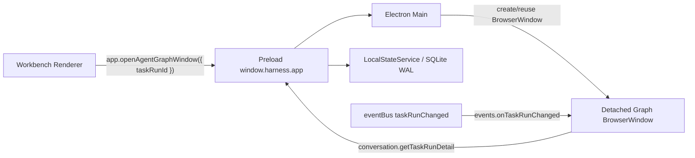

# Agent Topology Detached Window Design

## 목적

현재 `AgentTopologyPanel`은 Workbench 오른쪽 `Graph` 탭 안에서 선택된
`TaskRunDetail`을 시각화한다. 후속 작업에서는 같은 그래프를 앱 내부 modal이
아닌 별도 Electron `BrowserWindow`로 띄운다.

목표는 큰 화면에서 에이전트 실행 흐름, approval gate, A2A remote 상태를
계속 관찰할 수 있게 하는 것이다. 별도 창은 보조 표시 surface이며 canonical
state, runner, orchestration, approval 정책을 변경하지 않는다.

## 현재 상태

증거:

- `docs/design/agent-topology-panel.md`는 renderer-only 그래프 탭 설계를
  정의한다.
- `apps/desktop/src/screens/workbench/AgentTopologyPanel.tsx`는
  `TaskRunDetail` 조각을 받아 순수 그래프 모델을 렌더링한다.
- `apps/desktop/src/screens/workbench/agent-topology-model.ts`는
  `buildAgentTopology()` 순수 모델 builder를 제공한다.
- `apps/desktop/src/screens/workbench/RightPanel.tsx`의 `Graph` 탭은
  `AgentTopologyPanel`을 직접 포함한다.
- `apps/desktop/electron/main.ts`의 기존 main window는 `BrowserWindow`를
  생성하고 `renderer/index.html`을 로드한다.

추론:

- 별도 창도 같은 renderer bundle을 로드하되, 창 query/hash에
  `taskRunId`와 window mode를 전달하면 `AgentTopologyPanel`을 재사용할 수
  있다.
- `TaskRunDetail` snapshot을 main process에서 전달하는 방식보다, 새 창이
  `taskRunId` 기준으로 `conversation.getTaskRunDetail()`을 직접 호출하고
  `events.onTaskRunChanged()`를 구독하는 방식이 실행 중 갱신에 안전하다.

## 비목표

- Express, localhost server, WebSocket server를 추가하지 않는다.
- renderer에서 Node API, raw `ipcRenderer`, SQL, filesystem, shell에 접근하지
  않는다.
- 그래프 전용 canonical DB table을 만들지 않는다.
- `TaskRunDetail` 전체 JSON을 window-open payload로 장기간 들고 있지 않는다.
- agent/orchestration 실행 순서나 approval 정책을 바꾸지 않는다.

## 권장 아키텍처



별도 창은 독립 renderer process다. 따라서 부모 `RightPanel`의 React state를
공유하지 않는다. 새 창은 `taskRunId`를 입력으로 받아 매번 canonical state를
pull한다.

## Public IPC 계약

`window.harness.app` namespace에 창 열기 메서드를 추가한다.

```ts
app.openAgentGraphWindow(input: { taskRunId: string }): Promise<void>;
```

계약 규칙:

- `taskRunId`는 non-empty string이어야 한다.
- main process는 존재하지 않는 `taskRunId`를 즉시 검증하거나, 새 창 renderer가
  `getTaskRunDetail` 실패를 빈 상태로 표시하게 할 수 있다. 권장안은 main에서
  `state.getTaskRun(taskRunId)`로 fail-fast 검증하는 것이다.
- 이미 같은 `taskRunId`용 창이 열려 있으면 새 창을 만들지 않고 focus한다.
- 다른 `taskRunId`는 별도 창을 허용하되, 첫 구현에서는 전역 1개 창만 허용해도
  된다. 전역 1개 정책이면 새 요청은 기존 창 URL을 교체하고 focus한다.

수정 대상:

1. `packages/core/src/ipc-channels.ts`
   - `app.openAgentGraphWindow` channel 추가
   - `isAllowedChannel` 테스트 갱신
2. `packages/core/src/api.ts`
   - `HarnessDesktopApi.app.openAgentGraphWindow` 타입 추가
3. `docs/contracts/ipc-contracts.md`
   - app namespace 계약 문서화
4. `apps/desktop/electron/preload.ts`
   - `invokeUnwrapped<void>(IPC_CHANNELS.app.openAgentGraphWindow, input)`
5. `apps/desktop/electron/ipc/app-ipc.ts` 또는 기존 app IPC 등록 파일
   - payload shape 검증 후 main 창 관리자 호출
6. `apps/desktop/electron/ipc/index.ts`
   - 필요한 경우 app IPC deps에 window manager 주입
7. `apps/desktop/src/types/window.d.ts`
   - renderer 타입 선언 갱신

## Main Process Window Manager

`apps/desktop/electron/main.ts`에 모든 창 생성 로직을 직접 누적하지 말고, 작은
helper로 분리한다.

권장 파일:

- `apps/desktop/electron/agent-graph-window.ts`

책임:

- `createOrFocusAgentGraphWindow(input)`
- 기존 창 Map 관리
- parent main window가 닫혀도 graph window 정리 정책 적용
- 외부 navigation 차단
- preload는 기존 `../preload/preload.cjs` 재사용
- `nodeIntegration: false`, `contextIsolation: true`, `sandbox: true`,
  `webSecurity: true` 유지

초기 정책:

```ts
const graphWindows = new Map<string, BrowserWindow>();
```

창 옵션 권장값:

- `width: 1180`
- `height: 820`
- `minWidth: 760`
- `minHeight: 520`
- `backgroundColor: "#0e1116"`
- `show: false`

로드 방식:

```ts
const urlHash = `#/agent-graph?taskRunId=${encodeURIComponent(taskRunId)}`;
await win.loadFile(rendererIndexHtmlPath, { hash: urlHash });
```

주의:

- dev server를 새로 만들지 않는다.
- `window.open()`을 허용하지 않는다. 열기는 main-owned IPC로만 한다.
- `will-navigate`는 기존 main window와 같은 allowlist를 적용한다.

## Renderer Entry 설계

현재 `apps/desktop/src/app/App.tsx`는 항상 `WorkbenchShell`을 렌더링한다.
별도 창을 지원하려면 renderer entry에서 hash/query를 읽어 surface를 분기한다.

권장 구조:

- `apps/desktop/src/app/App.tsx`
  - `window.location.hash`를 읽어 mode 판정
  - `#/agent-graph?taskRunId=...`이면 `DetachedAgentTopologyWindow` 렌더
  - 그 외에는 기존 `WorkbenchShell` 렌더
- `apps/desktop/src/screens/workbench/DetachedAgentTopologyWindow.tsx`
  - `taskRunId` parsing
  - `conversation.getTaskRunDetail({ taskRunId })` initial load
  - `events.onTaskRunChanged(({ taskRunId }))` 구독 후 같은 id만 refresh
  - loading/error/empty state 표시
  - `AgentTopologyPanel variant="detached"` 또는 `variant="large"` 재사용

Renderer state machine:

```ts
type DetachedGraphState =
  | { kind: "loading" }
  | { kind: "ready"; detail: TaskRunDetail }
  | { kind: "error"; message: string };
```

새 창의 닫기 버튼은 OS 창 닫기를 직접 호출할 필요가 없다. Electron 창 닫기
API를 renderer에 노출하지 않는 것이 더 안전하다. 사용자는 window chrome으로
닫고, 필요하면 나중에 `app.closeCurrentUtilityWindow()` 같은 제한 API를 별도
설계한다.

## Workbench UI 변경

오른쪽 `Graph` 탭 header에 `별도 창` 버튼을 둔다.

동작:

- `state.kind !== "ready"`이면 버튼 비활성화
- 클릭 시 `window.harness.app.openAgentGraphWindow({ taskRunId })`
- 실패 시 기존 inline error surface 또는 toast/banner에 에러 표시

기존 Graph 탭은 유지한다. 별도 창은 확대/관찰용이고, 오른쪽 패널은 빠른
스캔용이다.

## 상태 갱신

별도 창은 polling하지 않는다.

1. mount 시 `conversation.getTaskRunDetail({ taskRunId })`
2. `events.onTaskRunChanged` 구독
3. 이벤트의 `taskRunId`가 현재 창의 id와 같으면 fresh detail pull
4. unmount 시 unsubscribe

이 방식은 기존 renderer push/pull 계약과 일치한다. main process가 graph
window에 별도 push channel을 만들 필요가 없다.

## 보안과 권한

- 새 창도 기존 preload만 사용한다.
- `nodeIntegration`은 계속 false다.
- `contextIsolation`과 `sandbox`는 계속 true다.
- renderer는 `window.harness.*` 외 Electron 객체를 모른다.
- open-window IPC는 side effect가 아니다. 파일, shell, git, runner를 실행하지
  않는다.
- 외부 URL navigation은 기존 main window와 동일하게 차단한다.

## 구현 단계

### Phase 1 - Contract and Window Manager

파일:

- `packages/core/src/ipc-channels.ts`
- `packages/core/src/api.ts`
- `apps/desktop/electron/agent-graph-window.ts`
- `apps/desktop/electron/ipc/app-ipc.ts`
- `apps/desktop/electron/ipc/index.ts`
- `apps/desktop/electron/preload.ts`
- `apps/desktop/src/types/window.d.ts`
- `docs/contracts/ipc-contracts.md`

완료 조건:

- `openAgentGraphWindow({ taskRunId })`가 존재하는 TaskRun에 대해 창을 생성한다.
- 같은 TaskRun에 대해 중복 창을 만들지 않고 focus한다.
- 잘못된 payload는 `HarnessError`로 실패한다.

### Phase 2 - Detached Renderer Surface

파일:

- `apps/desktop/src/app/App.tsx`
- `apps/desktop/src/screens/workbench/DetachedAgentTopologyWindow.tsx`
- `apps/desktop/src/screens/workbench/AgentTopologyPanel.tsx`
- `apps/desktop/src/screens/workbench/workbench.css`

완료 조건:

- `#/agent-graph?taskRunId=...` 진입 시 WorkbenchShell 대신 그래프 전용 화면을
  렌더링한다.
- 새 창은 initial detail을 로드하고 TaskRun 변경 이벤트에 따라 갱신한다.
- loading/error/empty 상태가 화면을 깨뜨리지 않는다.

### Phase 3 - Workbench Button

파일:

- `apps/desktop/src/screens/workbench/RightPanel.tsx`
- 필요 시 `FeatureHelpButton` 문구 또는 관련 도움말 파일

완료 조건:

- 오른쪽 Graph 탭에서 `별도 창` 버튼이 보인다.
- 선택된 TaskRun이 없으면 버튼은 렌더링되지 않거나 비활성화된다.
- 클릭 실패는 사용자에게 보인다.

### Phase 4 - Verification and Cleanup

검증:

- `npm run check`
- `npm --workspace @harness/desktop run build`
- `node --import tsx --test --test-force-exit apps/desktop/src/screens/workbench/agent-topology-model.test.mjs`
- 새 IPC drift 테스트가 있다면 해당 테스트
- 가능하면 Electron smoke:
  - TaskRun 선택
  - Graph 탭에서 별도 창 열기
  - 실행 중 TaskRun 상태 변경
  - 별도 창 그래프가 갱신되는지 확인

환경 주의:

- DB 기반 테스트 전에는 `better-sqlite3`가 현재 Node ABI에 맞게 rebuild되어야
  한다.
- Electron 실행 중이면 `better_sqlite3.node`가 잠겨 `npm run rebuild:node`가
  실패할 수 있다.

## 테스트 계획

단위 테스트:

- `IPC_CHANNELS.app.openAgentGraphWindow`가 allowlist에 포함된다.
- preload app API shape에 새 메서드가 포함된다.
- detached URL parser가 유효/무효 taskRunId를 구분한다.
- `DetachedAgentTopologyWindow`는 matching `taskRunChanged` 이벤트에서만
  refresh한다.

통합 테스트:

- main window에서 `openAgentGraphWindow` 호출 시 BrowserWindow 생성 함수가
  호출된다.
- 같은 `taskRunId`로 두 번 호출하면 기존 window focus만 수행한다.
- window closed 후 같은 `taskRunId`로 다시 열면 새 window가 만들어진다.

수동 검증:

- main Workbench와 detached graph window가 동시에 떠 있어도 UI가 멈추지 않는다.
- detached window에서 외부 URL navigation이 차단된다.
- OS 창 닫기 후 main Workbench가 계속 정상 동작한다.

## 리스크

- 새 renderer entry가 `WorkbenchShell` 초기화와 충돌하면 main window도 빈 화면이
  될 수 있다. `App.tsx` 분기는 작게 유지하고 URL parser를 테스트한다.
- TaskRun 삭제 후 detached window가 열린 상태일 수 있다. 이 경우 `not found`
  에러 상태를 표시하고 자동으로 main window를 조작하지 않는다.
- 여러 창이 동시에 `events.onTaskRunChanged`를 구독하면 refresh 호출이 늘어난다.
  그래도 이벤트 기반 pull이며 polling이 아니므로 초기 구현에서는 허용 가능하다.
- 같은 provider CLI 큐나 orchestration 병렬 실행 정책과는 독립이다. 그래프 창은
  관찰 surface일 뿐 실행 concurrency를 바꾸지 않는다.

## 결정

별도 창은 Electron main process가 소유한다. renderer는 `taskRunId`만 전달하고,
새 창은 기존 `window.harness.conversation.getTaskRunDetail`와
`window.harness.events.onTaskRunChanged`를 사용해 canonical state를 직접
따라간다. 이 방식이 renderer 상태 공유나 snapshot 전달보다 실행 중 갱신,
보안 경계, 유지보수성 측면에서 더 안전하다.
